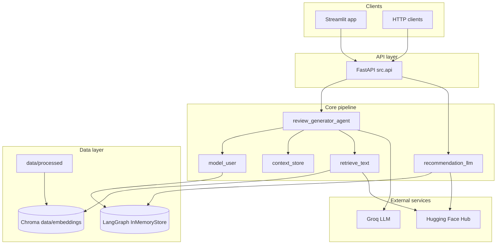
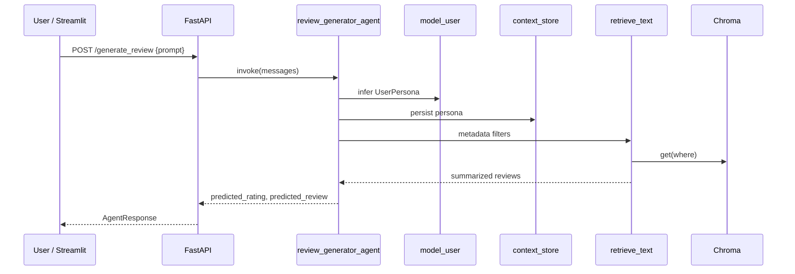
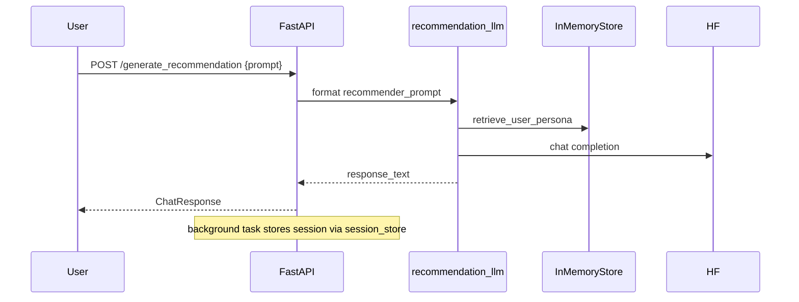

# Architecture

The Behavioural Intelligence Agent is organized as a **library-first** design: business logic lives in `src/`, with thin adapters for HTTP (FastAPI) and Streamlit. Offline jobs and notebooks prepare data and refresh indexes.

## System context

## Layer responsibilities

### Configuration (`src/config`)

- **`constants.py`** — Project paths (`DATA_DIR`, `PROCESSED_DATA_DIR`, `EMBEDS_DIR`, etc.).
- **`settings.py`** — Pydantic settings from `.env`: API host/port, embedding model (`sentence-transformers/all-MiniLM-L6-v2`), Chroma collection name (`review_data`), summarization and chat model IDs, Hugging Face embedding function factory.

### Core (`src/core`)

| Module | Role |
|--------|------|
| `persona_builder.py` | Rule-based inference from text signals → `UserPersona`; exposes `model_user` LangChain tool |
| `memory_layer.py` | `context_store` tool + `retrieve_user_persona` for recommendation prompts |
| `prompt_engine.py` | Review agent system prompt, recommendation template, session stub, evaluation plan hook |
| `utils.py` | Shared resource handles: `MEMORY`, `VECTORDB`, `LLM`, `HF_LLM_PROVIDER`; `startup_resources()` for API lifespan |

### Embeddings (`src/embeddings`)

| Module | Role |
|--------|------|
| `indexer.py` | Batch upsert into Chroma: flatten row → metadata + review list per `record_id` |
| `embedder.py` | Optional semantic chunking / HuggingFaceEmbeddings batch encoding (offline or alternate paths) |

Indexing uses Chroma’s `HuggingFaceEmbeddingFunction` configured in settings. Documents stored per user are the five `history[n]` review texts; metadata holds behavioural profile and Nigerian adaptation fields (lowercased at index time).

### Retrieval (`src/retrieval`)

| Module | Role |
|--------|------|
| `search.py` | `retrieve_text` tool — **metadata-only** `collection.get(where=...)`, no semantic query string |
| `context_summarizer.py` | Compresses retrieved review blobs via HF summarization before returning to the agent |

### Generation (`src/generation`)

| Module | Role |
|--------|------|
| `review_generator.py` | LangGraph `create_react_agent` with tools: `model_user`, `context_store`, `retrieve_text` |
| `recommendation_generator.py` | HF `InferenceClient.chat.completions` using persona + session template |

### Evaluation (`src/evaluation`)

| Module | Role |
|--------|------|
| `metrics.py` | OpenEvals judges: RAG helpfulness, plan adherence (Groq-backed) |
| `evaluator.py` | `evaluation_pipeline(prompt, output)` runs all metrics |

### API (`src/api`)

- **`main.py`** — FastAPI app with lifespan calling `startup_resources()`; exports `server` for uvicorn.
- **`routes.py`** — `/health`, `/generate_review`, `/generate_recommendation`.
- **`schemas.py`** — `UserRequest`, `AgentResponse`, `ChatResponse`, `UserPersona`, `ReviewRetrievalCriteria`.

### UI (`app/`)

Multipage Streamlit app:

1. **Home** (`streamlit_app.py`) — architecture overview, API health, navigation.
2. **Review generator** — structured inputs → composed prompt → `POST /generate_review`; local persona preview via `build_user_persona`.
3. **Recommendations** — chat against `/generate_recommendation`.
4. **Evaluation** — offline judge UI over prompt/output pairs.
5. **Persona explorer** — browse `persona_library_flattened.json` records.

`app/shared.py` centralizes API URL, health checks, demo copy, and persona → retrieval filter mapping for demos.

### Logging (`src/logging`)

`audit_log.log_event` — structured INFO lines for batch indexing and operational events.

## Primary request flows

### Review generation

The agent system prompt instructs JSON-only output: `predicted_rating`, `predicted_review`. Tool use order is left to the ReAct loop.

### Recommendation chat

Recommendations expect a persona already stored (typically after review generation). Empty persona yields a fixed guardrail message in the prompt template.

## Data flow (offline)

1. Raw / structured persona records (JSON) → flatten (`src/data/preprocess.py`, notebooks).
2. Wide formatted tables → cleaning notebook → `persona_libray_cleaned.csv`.
3. `scripts/build_embeddings.py` → Chroma under `data/embeddings/`.
4. Optional encoding script (`scripts/data_encoding.py`) for ML experiments → `formatted_wide_encoded.csv`.

## Technology choices

| Concern | Choice |
|---------|--------|
| Vector store | Chroma persistent client |
| Embeddings | Hugging Face sentence-transformers via Chroma embedding function |
| Review agent orchestration | LangGraph prebuilt ReAct agent |
| Review LLM | Groq (`llama-4-scout-17b`) |
| Recommendation / summarization | Hugging Face Inference API |
| Session / persona memory | LangGraph `InMemoryStore` (process-local) |
| HTTP | FastAPI + Uvicorn |
| UI | Streamlit multipage + optional Mermaid diagrams |

## Extension points

- Swap `startup_resources()` providers or add a dedicated `init_vectordb()` for batch-only workers.
- Replace metadata-only retrieval with hybrid semantic + metadata search in `retrieve_text`.
- Persist `MEMORY` and Chroma to shared infrastructure for multi-instance API deployments.
- Wire `scripts/run_evaluation.py` to batch-score API outputs into `models/evaluation/`.
